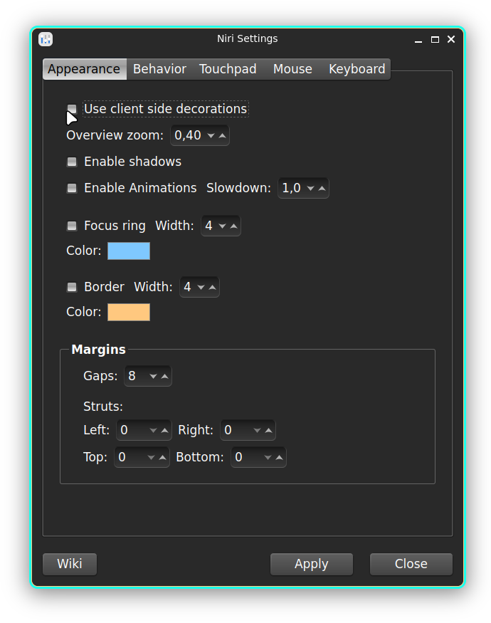

## niri-settings

> GUI in Qt for configure niri

## Usage

**Note**: it needs a sepateted included `input.kdl` config file.

.
If no argument is given `$XDG_CONFIG_HOME/lxqt/wayland/niri/input.kdl` is used, otherwise
`niri-settings /path/to/input.kdl` can be used.

